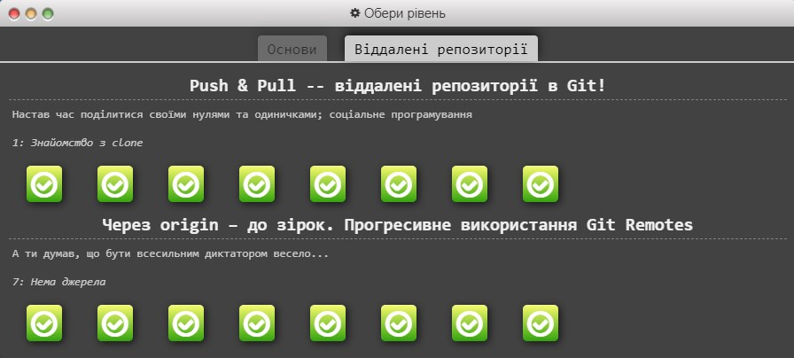

# kottans-frontend
## General
## 0. Git Basics
### Git та GiHub
1. [x] Version Control with Git (Udacity)

  
Srcreenshots

  
  

2. [x] Learngitbranching

  
Srcreenshots

  
  

---
* Раніше вважав, що GitHub Desktop - це і є Git, але ні :), для мене Git зовсім нове.
* Здивувало, що за допомогою декілька команд у Git, можна багато чтго зробити.
* Деякі команди Git:

  
Git commands

  
   - git init - _створити новий репозиторій_
   - git clone <path-to-repository-to-clone> - _клонувати репозиторій_
   - git status - _визначити статус репозиторію_
   - git log - _відобразити коміти сховища_
   - git log --one line - _однією лінією_
   - git log --stat - _перегляд змінених файлів_
   - git log -p - _перегляд змін у файлі_
   - git log -p - --stat _скільки файлів було змінено і кількість змінених рядків_
   - git log -p -w - _ігнорувати пробіли_ 
   - git add <file1> <file2> ... <fileN> - _переміщення файлів із робочого каталогу до проміжного індексу_
   - gid add . - _додати все_
   - git show -  _показати комміт_
   - git commit -m "My commit" - _додати комміт до репо_
   - git fetch - _витягує дані з віддаленого репозиторію_
   - git pull - _витягує дані з віддаленого репозиторію та робить мердж (merge)_
   - git push - _використовується для надсилання локальних змін на вказаний віддалений репозиторій_
   - git rebase - _бере кілька комітів, "копіює" їх, й кладе їх в інше місце_
   - git cherry-pick <Коміт1> <Коміт2> <...> - _копіює серію комітів до поточного розташування (HEAD)_
   - git diff - _перегляд внесених але ще не зафіксованих змін_
   - git tag -a <tagName> -m "my version 1.4" - _додати таг до комміту_
   - git tag -d <tagName> - _видалити таг_
   - git branch - _список гілок у сховищі_
   - git branch <branchName> <SHA> - _створити гілку_
   - git branch -d <branchName> - _видалити гілку_
   - git checkout <branchName> - _перейти на гілку_
   - git log --oneline --decorate - _відображення гілок_
   - git checkout -b footer master - _створити нову гілку та переключитися на неї_
   - git log --oneline --decorate --graph --all - _переглянути всі гілки одразу_
   - git reset --hard HEAD^ - _скасувати злиття_
   - git merge <name-of-branch-to-merge-in> - _злиття гілок_
   - git commit --amend - _зміна останнього комітту_
   - git revert <SHA-of-commit-to-revert> - _повернення комміту_
   - git reflog - _отримати доступ до стертого вмісту_
   - git reset <reference-to-commit> - _скидання (стертя) комміту_
   - git reset --mixed - _візьме зміни, внесені в комміт і перемістить їх до робочого каталогу_
   - git reset --soft - _візьме зміни, внесені в комміт і перемістить їх до індекcу проміжку_
   - git reset --hard - _візьме зміни, внесені в комміт і зітре їх_
  .gitignore
  fileName
  

  
## 1. Linux CLI, and HTTP
 ### Linux, Command Line, HTTP Tools
  1. [x] Linux Survival (4 modules)
  2. [x] HTTP: Протокол, який повинен розуміти кожний веб-розробник - Частина 1
  3. [x] HTTP: Протокол, який повинен розуміти кожний веб-розробник - Частина 2
  
  Screenshot of completed lessons:

  
Quiz 1

  

  
Quiz 2

  

  
Quiz 3

  

  
Quiz 4

  

  
  ---
  * Linux для мене зовсім нова система, але все зрозуміло, з першим та другим Quiz було не складно, а ось з третім та четвертим треба було подумати :)
  * Файлова система Linux схожа з Microsoft Windows, також нагадала мені Git.
  * Деякі команди Linux:
  

    
Linux commands

    
   - ls - _використовується для перерахування вмісту каталогу_
   - ls -l - _використовується для перерахування довгого списку_
   - more - _відображення вмісту файлу_
   - mkdir -> name of directory (make directory) - _создание каталога_
   - mv file _name_ -> _name_ directory (move) - _переміщення файлів_
   - mv file _name_ -> _name_ of new file - _ця команда також є перейменуванням файлів_
   - cd -> _name_ directory - _зміна каталогу_
   - pwd (print working directory) - _місцезнаходження у структурі каталогу_
   - cp (copy) - _копіювання_
   - rm - _видалення файлу_
   - rmdir (remove directory) - _видалення каталогу_
   - rm -r - _видалення дерева каталогів_
   - chmod (change mode) - _використовується для зміни дозволів безпеки для файлів_
   - ~ - _домашній каталог_
   - man (manual) - _визначити ідентифікатор користувача_
   - find - _використовується для пошуку файлів_
   - cat - _об'єднання файлів_
   - df (disk free) - _скільки дискового простору залишилося у вашій системі_
   - ps (process status) - _використовується для перевірки запущених програм/процесів_
   - ps aux - _детальний список усіх процесів_
   - grep - _використовувати, щоб знайти шаблони в даних_
   - ps aux | grep ... - 
   - kill PID (PID - ID процесу) - _припинення процесу_
   - kill -9 PID - _щоб наказати процесу негайно припинити роботу_
   

  
  ---
  ## 2. Git Collaboration
  ### Git для командної співпраці
  1. [x] Introduction to Git and GitHub (тижні 3 і 4 курсу)
  2. [x] Learngitbranching
  
  Screenshots of completed lessons:

  
Introduction to Git and GitHub

  
  

  
Learngitbranching

  
  

## 3. Intro to HTML and CSS
1. [ ] Introduction to Responsive Design
2. [ ] Learn HTML
3. [ ] Learn CSS
  
